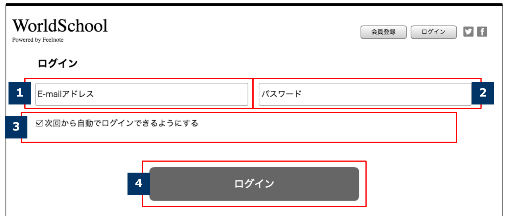

== A-1 Login

=== Thông số cơ bản
[cols="38,80"]
|=====
| Method, URL            | GET\|POST /signin
| Controller, Action     | users/sessions#signin
| Tên route              | new_user_session
| View                   | users/sessions/new.html.erb
|=====

=== Request
* Chi tiết ở bảng định nghĩa FORM bên dưới.

include::./_include/note_devise.adoc[]

<<<

=== Chi tiết

. Email
** Xuất dưới dạng tag là input với hạng mục là `email`
. Mật khẩu
** Xuất dưới dạng tag là input với hạng mục là `password`
** Nếu xuất hiện màn hình lỗi sau ấn login, không chứa nội dung đã nhập trước đó
. Lưu lại login
** Xuất dưới dạng tag là input với hạng mục là `checkbox`
** Giá trị mặc định là không được chọn
. Nút Login
** Trường hợp *Login thành công*
*** Sử dụng `Devise` tạo session
*** Chuyển về trang `B-1`
** Trường hợp *Login thất bại*
*** Trả lại màn hình này và xuất các thông báo lỗi cần thiết.

<<<

include::../../form_site/vi/_include/A-1.adoc[]
