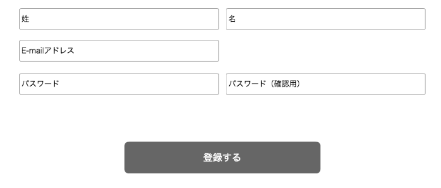

== A-1 管理ユーザ編集

=== 概要

管理ユーザーを編集する

=== ワイヤーフレーム

https://docs.google.com/presentation/d/1FioO81AzrWux_G0IQnMI-RIIVhNFcKCN64hdf075AnI/edit#slide=id.g16c0bd5dba_0_25

=== 基本情報

[options="header"]
|==================
|項目|内容|備考
|URL|/admin/users/:user_id/edit|法人スーパーユーザーのみが利用可能
|==================

=== 仕様

==== 管理ユーザー登録フォーム

* *管理者氏名：姓*
** text inputにて入力

* *管理者氏名：名*
** text inputにて入力

* *メールアドレス*
** text emailにて入力

////
* *パスワード*
** text passwordにて入力

* *パスワード：確認用*
** text passwordにて入力
////

* *登録ボタン*
*** submitにて登録を行う
