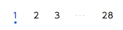
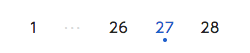
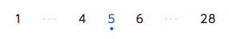

== C-1 イベント一覧

=== 概要

登録済みの記事一覧を表示する

=== ワイヤーフレーム

https://docs.google.com/presentation/d/1FioO81AzrWux_G0IQnMI-RIIVhNFcKCN64hdf075AnI/edit#slide=id.g1625bcd3c5_0_41

=== 基本情報

[options="header"]
|==================
|項目|内容|備考
|URL|/admin/events|
|==================

=== 仕様

==== タブ

. タブ

** *共通*
*** カレントの表示
**** 選択されているカレントタブ、そうでないタブが表現されている
** *タブボタン*
*** 公開一覧／非公開一覧の2種
*** 押下によりそれぞれ切り替える

==== イベント一覧

. イベントモジュール

** *共通*
*** 公開／非公開ステータスによってそれぞれに対応したデザインが表現されている
*** 表示制御
**** 「公開一覧」では公開ステータスのみ、「非公開一覧」では非公開ステータスのイベントのみ表示されている。

** *公開ステータス*
*** 公開／非公開 の2種類。該当イベントの公開ステータスを表示する。

** *公開ボタン*
*** 非公開ステータスのイベントモジュールにのみ存在する
*** confirmによる「はい」「いいえ」の確認を通した後、API通信経由にて公開に設定する
... confirm「はい」
**** API通信経由にて公開に設定する
... confirm「いいえ」
**** なにもしない(confirm画面を閉じる)
*** イベント記事をAPI通信経由にてイベント一覧を最新状態に更新する

** *非公開ボタン*
*** 公開ステータスのイベントモジュールにのみ存在する
*** confirmによる「はい」「いいえ」の確認を通した後、API通信経由にて非公開に設定する
*** イベント記事をAPI通信経由にてイベント一覧を最新状態に更新する

** *編集ボタン*
*** 押下で編集画面に遷移する

** *削除ボタン*
*** confirmによる「はい」「いいえ」の確認を通した後、API通信経由にて記事を削除する
*** イベント記事をAPI通信経由にてイベント一覧を最新状態に更新する

==== ページネーション

. 次ページ、前ページ

** *戻るボタン*
*** 現在のページが1ページ目のときは、disable状態
*** 押下にて(現在のページ-1)ページへ遷移する

** *次へボタン*
*** 現在のページが最終ページのときは、disable状態
*** 押下にて(現在のページ+1)ページへ遷移する

. ページャー

** *ページ選択ボタン*
*** 押下にて選択ページへ遷移する
*** 現在のページによって表示パターンが存在する link:http://www.morisawa.co.jp/fonts/specimen/[参考ページ]
... 現在のページが(3)以下のとき
**** 123･･･最終ページ
... 現在のページが(最終ページ-3)以上のとき
**** 1･･･(最終ページ-2)(最終ページ-1)(最終ページ)
... 上記以外のとき
**** 1･･･(現在ページ-1)(現在ページ)(現在ページ+1)･･･最終ページ

例

////
. フォーム
** フォーム定義書の各フィールドを出力する

include::../../form_admin/ja/_include/A-3.adoc[]
////

////
. 送信ボタン
** `A-2` へ POST 送信する
////
