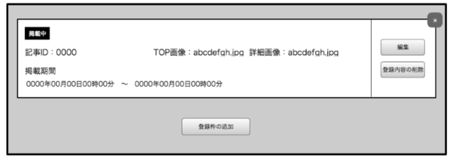
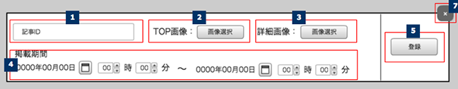
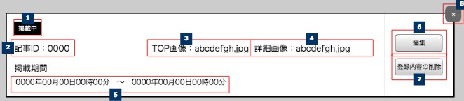

== A-1 管理ユーザ登録

=== 概要

プロモーションエリアに掲載する内容の追加、削除、編集を行う

=== ワイヤーフレーム

https://docs.google.com/presentation/d/1FioO81AzrWux_G0IQnMI-RIIVhNFcKCN64hdf075AnI/edit#slide=id.g165272825b_2_233

=== 基本情報

[options="header"]
|==================
|項目|内容|備考
|URL|/admin/promotion|法人スーパーユーザーのみが利用可能
|==================

=== 仕様

==== プロモーション一覧

. プロモーション枠モジュール

** *共通*
*** プロモーション枠モジュールは4件固定管理
*** プロモーションモジュールは5件まで登録可能
*** プロモーションモジュールの登録時に +
プロモーション枠モジュール毎に重複チェックを行う　// TODO:チェックはフロント？バックエンド？

** *登録枠の追加ボタン*
*** プロモーションモジュールを1つ増やす、最大5件まで
... 0〜4件のとき
**** ボタンは表示される
... 5件のとき
**** ボタンはdiable状態になり追加できない
... プロモーションモジュールが編集中のとき

** *登録枠の削除ボタン*
*** ・押下時：confirm確認ダイヤログにより「はい」の選択でプロモーションの登録枠の削除
... confirm「はい」を
**** プロモーションの登録枠の削除 //TODO:削除ロジックを確認
.... 登録済みのプロモーションを削除する時
***** API通信経由にてプロモーションの登録枠の削除
.... 登録枠を追加して非登録なものを削除する時
***** API通信ナシでプロモーションの登録枠の削除
... confirm「いいえ」
**** なにもしない(confirm画面を閉じる)

. プロモーションモジュール(共通)
** *共通*
*** API経由にて取得したワイヤーにある項目に情報を適切に表示する

. プロモーションモジュール(登録済み)：仕様表明が必要な箇所のみ抜粋して記載

** *掲載ステータス表示*
*** 掲載ステータスを表示：掲載中／未掲載のどちらかを表示

** *Top画像名表示*
*** ファイル名を表示する
**** 表示形式：ファイル名+拡張子

** *詳細画像名表示*
*** ファイル名を表示する
**** 表示形式：ファイル名+拡張子

** *掲載期間表示*
*** プロモーションエリアの掲載期間を表示する
**** 表示形式：yyyy年MM月dd日HH時mm分〜yyyy年MM月dd日HH時mm分

** *編集ボタン*
*** 押下時：情報の編集状態となる
... プロモーション枠モジュールが編集状態のとき
**** ボタンは表示しない

** *登録内容の削除ボタン*
*** 押下時：confirm確認ダイヤログにより「はい」の選択で登録情報の削除
... confirm「はい」
**** API通信経由にて登録情報の削除 //TODO : 削除ロジックを確認
**** (単純に内容を空にする？？？)
... confirm「いいえ」
**** なにもしない(confirm画面を閉じる)
... プロモーション枠モジュールが編集状態のとき
**** ボタンは表示しない

. プロモーション枠モジュール(編集)

** *登録ボタン*
*** 押下時：confirm確認ダイヤログにより「はい」の選択で登録の実行
... confirm「はい」
**** API通信経由にて登録の実行
... confirm「いいえ」
**** なにもしない(confirm画面を閉じる)
... プロモーション枠モジュールが登録済み状態のとき
**** ボタンは表示しない

** *登録フォーム*
*** 別表にて

include::../../form_admin/ja/_include/D-1.adoc[]
