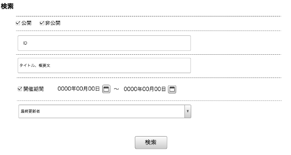

== E-1 検索

=== 概要

登録記事を検索し、公開の制御や内容の編集を行う

=== ワイヤーフレーム

https://docs.google.com/presentation/d/1FioO81AzrWux_G0IQnMI-RIIVhNFcKCN64hdf075AnI/edit#slide=id.g165272825b_2_375

=== 基本情報

[options="header"]
|==================
|項目|内容|備考
|URL|/admin/events/search|
|==================

=== 仕様

==== 検索条件

.検索モジュール

* *公開ステータス*
** 公開／非公開の2種

* *開催期間使用チェックボックス*
** チェックがONのときに開催期間(開始)、開催期間(終了)フォームの内容を用いて検索する
** チェックのON／OFFで開催期間入力が可能／不可能になる
... チェックON
*** 開催期間(開始)、開催期間(終了)フォームがenableになる
... チェックOFF
*** 開催期間(開始)、開催期間(終了)フォームがdisableになる

* *開催期間(開始)*
** 日付を入力する

* *開催期間(終了)*
** 日付を入力する

* *最終更新者*
** プルダウンより選択する

* *検索ボタン*
** 検索を実行する

.検索モジュールフォーム
include::../../form_admin/ja/_include/E-1.adoc[]

==== 検索結果

image::_include/E-1_search_result_module.png[]

===== 検索結果件数

** 検索結果件数を表示する

//ページネーション
include::_include/_pagenation.adoc[]

===== 検索結果一覧

* *共通*
** 0件のときはページャーを外して0件時の文言を出す。
*** 検索結果はありませんでした。　の表示

TODO : フォーム定義書の maxlength を追記。

.検索結果記事モジュール

* *最終更新日時*
** yyyy年MM月dd日 hh:mm　の形式で表示する

* *最終更新担当*
** 氏名を表示する

* *公開／非公開ステータス*
** 公開／非公開のどちらかのステータスを表示する

* *イベントタイトル*
** イベントタイトルを表示する

* *公開日時*
** yyyy年MM月dd日 hh:mm　の形式で表示する

* *非公開日時*
** yyyy年MM月dd日 hh:mm　の形式で表示する

* *公開ステータス*
** 公開／非公開 の2種類。該当イベントの公開ステータスを表示する。

* *公開ボタン*
** 非公開ステータスのイベントモジュールにのみ存在する
** confirmによる「はい」「いいえ」の確認を通した後、API通信経由にて公開に設定する
** イベント記事をAPI通信経由にてイベント一覧を最新状態に更新する

* *非公開ボタン*
** 公開ステータスのイベントモジュールにのみ存在する
** confirmによる「はい」「いいえ」の確認を通した後、API通信経由にて非公開に設定する
** イベント記事をAPI通信経由にてイベント一覧を最新状態に更新する

* *編集ボタン*
** 押下で編集画面に遷移する

* *削除ボタン*
** confirmによる「はい」「いいえ」の確認を通した後、API通信経由にて記事を削除する
** イベント記事をAPI通信経由にてイベント一覧を最新状態に更新する
