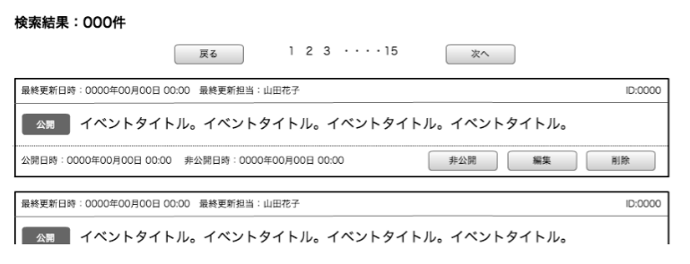
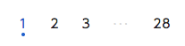
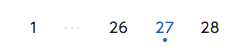

== E-1 検索

=== 概要

登録記事を検索し、公開の制御や内容の編集を行う

=== ワイヤーフレーム

https://docs.google.com/presentation/d/1FioO81AzrWux_G0IQnMI-RIIVhNFcKCN64hdf075AnI/edit#slide=id.g165272825b_2_375

=== 基本情報

[options="header"]
|==================
|項目|内容|備考
|URL||
|==================

=== 仕様

==== 検索条件

image::_include/E-1_search_module.png[]

. 検索モジュール

include::../../form_admin/ja/_include/E-1.adoc[]

** *公開ステータス*
*** 公開／非公開の2種

** *開催期間使用チェックボックス*
*** チェックがONのときに開催期間(開始)、開催期間(終了)フォームの内容を用いて検索する
*** チェックのON／OFFで開催期間入力が可能／不可能になる
.... チェックON
**** 開催期間(開始)、開催期間(終了)フォームがenableになる
.... チェックOFF
**** 開催期間(開始)、開催期間(終了)フォームがdisableになる

** *開催期間(開始)*
*** 日付を入力する

** *開催期間(終了)*
*** 日付を入力する

** *最終更新者*
*** プルダウンより選択する

** *検索ボタン*
*** 検索を実行する
*** // TODO:使用するAPIを確認する

==== 検索結果

===== 検索結果件数

*** 検索結果件数を表示する

==== ページネーション

. 次ページ、前ページ

** *戻るボタン*
*** 現在のページが1ページ目のときは、disable状態 //TODO:disable状態でよいか
*** 押下にて(現在のページ-1)ページへ遷移する

** *次へボタン*
*** 現在のページが最終ページのときは、disable状態 //TODO:disable状態でよいか
*** 押下にて(現在のページ+1)ページへ遷移する

. ページャー //TODO:ページャーの表示範囲は±1でよいか？

** *ページ選択ボタン*
*** 押下にて選択ページへ遷移する
*** 現在のページ、カレント表示状態の見た目を作る
*** 現在のページによって表示パターンが存在する link:http://www.morisawa.co.jp/fonts/specimen/[参考ページ]
... 現在のページが(3)以下のとき
**** 123･･･最終ページ
... 現在のページが(最終ページ-3)以上のとき
**** 1･･･(最終ページ-2)(最終ページ-1)(最終ページ)
... 上記以外のとき
**** 1･･･(該当ページ-1)(該当ページ)(該当ページ+1)･･･最終ページ

例

image::_include/pagenation_between.png[]

===== 検索結果一覧

TODO: 0件のときを確認する

TODO: 使用するAPIを確認する

. 検索結果記事モジュール

** *最終更新日時*
*** yyyy年MM月dd日 hh:mm　の形式で表示する

** *最終更新担当*
*** 氏名を表示する

** *公開／非公開ステータス*
*** 公開／非公開のどちらかのステータスを表示する

** *イベントタイトル*
*** イベントタイトルを表示する

** *公開日時*
*** yyyy年MM月dd日 hh:mm　の形式で表示する

** *非公開日時*
*** yyyy年MM月dd日 hh:mm　の形式で表示する

** *公開ステータス*
*** 公開／非公開 の2種類。該当イベントの公開ステータスを表示する。

** *公開ボタン*
*** 非公開ステータスのイベントモジュールにのみ存在する
*** confirmによる「はい」「いいえ」の確認を通した後、API通信経由にて公開に設定する
*** イベント記事をAPI通信経由にてイベント一覧を最新状態に更新する

** *非公開ボタン*
*** 公開ステータスのイベントモジュールにのみ存在する
*** confirmによる「はい」「いいえ」の確認を通した後、API通信経由にて非公開に設定する
*** イベント記事をAPI通信経由にてイベント一覧を最新状態に更新する

** *編集ボタン*
*** 押下で編集画面に遷移する

** *削除ボタン*
*** confirmによる「はい」「いいえ」の確認を通した後、API通信経由にて記事を削除する
*** イベント記事をAPI通信経由にてイベント一覧を最新状態に更新する
