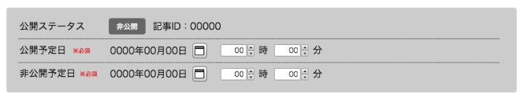
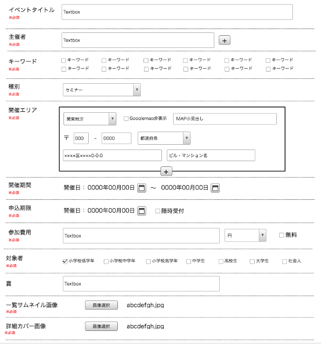
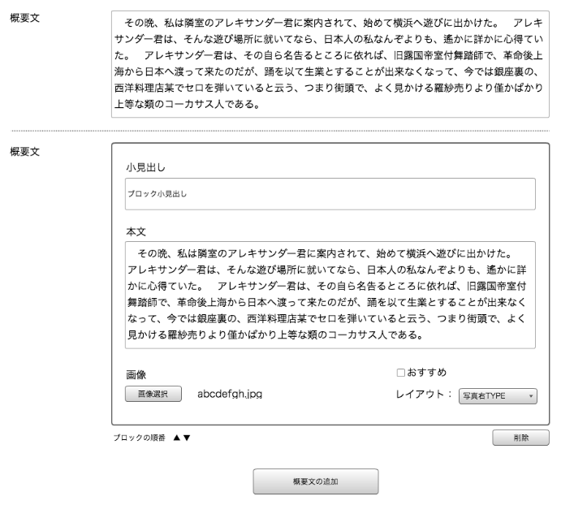
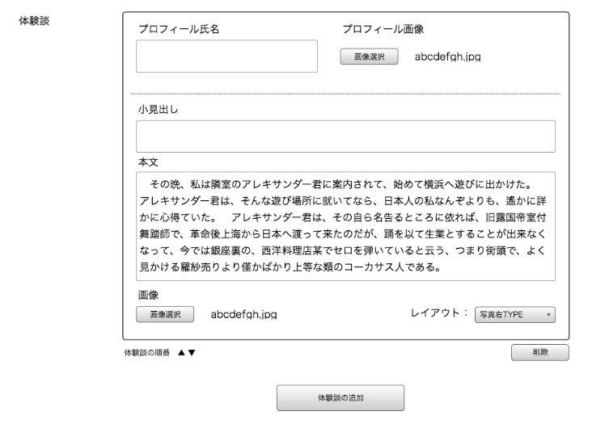
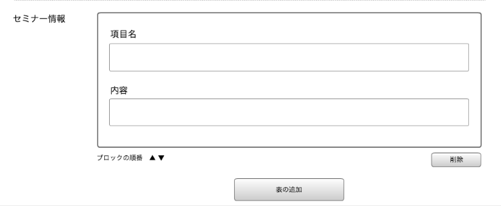
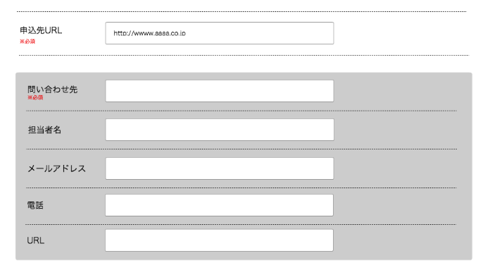

== F-1 イベント新規作成

=== 概要

イベントの新規登録を行う

=== ワイヤーフレーム

https://docs.google.com/presentation/d/1FioO81AzrWux_G0IQnMI-RIIVhNFcKCN64hdf075AnI/edit#slide=id.g165272825b_2_541

=== 基本情報

[options="header"]
|==================
|項目|内容|備考
|URL|/admin/events/new|新規作成
|==================

=== 仕様

TODO: 現在過去日付入力チェック等EFOをどこまでフロントで行うかを確認
TODO: 入力上限文字数を確認する

.プロモーション期間設定

* *公開ステータス*
** 公開／非公開の2種 //TODO:バックエンド側で表示を担保するか確認

* *記事ID*
** 記事IDを表示 //TODO:バックエンド側で表示を担保するか確認

* *公開予定日*(必須)
** datepickerを用いて公開予定日付を入力する

* *非公開予定日*(必須)
** datepickerを用いて非公開予定日付を入力する

.基本情報入力

* *イベントタイトル*(必須)
** input textにてタイトルを入力

* *主催者*(必須)
** input textにてタイトルを入力
** 「＋」ボタンでinput textボックスが1つ追加される
** //TODO: 削除ボタンはあるのかを確認する
** //TODO: 上限数を確認する

* *キーワード*(必須)：1個以上
** チェックボックスにてキーワードを選択

* *種別*(必須)
** プルダウンにて1つ選択

* *開催エリア*(必須)
** 「＋」ボタンでinput textボックスが1つ追加される
** //TODO: 削除ボタンはあるのかを確認する
** //TODO: 上限数を確認する

** *GoogleMap非表示チェックボックス*
*** チェックボックスにてGoogleMap表示状態入力

** *MAP小見出し*
*** input textにて地図の見出し名を入力

** *地方選択*
*** プルダウンにて地方を選択　//TODO:項目内容を確認
... 海外を選択する
**** 住所登録の項目をを英語にする
***** Address1
***** Address2
***** Country
***** City
***** State/Province
***** ZIP/PostalCode
... 海外以外を選択する
**** そのまま

** (地方選択で海外以外)

*** *郵便番号*
**** input textにて郵便番号を入力

*** *都道府県*
**** プルダウンにて都道府県を選択

*** *住所1*
**** input textにて入力

*** *住所2*
**** input textにて入力

** (地方選択で海外の場合)

*** *Address1*
**** input textにて入力

*** *Address2*
**** input textにて入力

*** *Country*
**** input textにて入力

*** *City*
**** input textにて入力

*** *State/Province*
**** input textにて入力

*** *ZIP/PostalCode*
**** input textにて入力

.概要文

* *概要文テキストエリア*
** textareaにて入力

* *概要文複数入力エリアモジュール 追加ボタン*
*** 概要文複数入力エリアモジュールを1つ追加する
*** //TODO : 上限数を確認する

* *概要文複数入力エリアモジュール*

** *小見出し*
*** input textにて入力

** *本文*
*** textareaにて入力

** *おすすめチェックボックス*
*** ONでおすすめとして表示する
*** OFFでおすすめとして表示しない

** *画像選択ボタン*
*** input fileにて画像を1枚選択する
**** *.jpg, *.png, *.gif //TODO : 拡張子を確認

** *レイアウト選択プルダウン*
*** select にて1つを選択 //TODO : 選択項目を確認
**** 写真右
**** 写真左

** *削除ボタン*
*** モジュールを消去する
*** モジュールが1つのときはボタンがdisableになる

** *ブロックの順序変更上ボタン*
*** モジュールが上のモジュールと入れ替わる
*** 最上部のときはボタンがdisableになる

** *ブロックの順序変更下ボタン*
*** モジュールが下のモジュールと入れ替わる
*** 最下部のときはボタンがdisableになる

.体験談

* *体験談モジュール 追加ボタン*
*** 体験談モジュールを1つ追加する
*** //TODO : 上限数を確認する

* *体験談モジュール*

** *プロフィール氏名*
*** input textにて入力

** *小見出し*
*** input textにて入力

** *本文*
*** textareaにて入力

** *プロフィール画像選択ボタン*
*** input fileにて画像を1枚選択する
**** *.jpg, *.png, *.gif //TODO : 拡張子を確認

** *レイアウト選択プルダウン*
*** select にて1つを選択 //TODO : 選択項目を確認
**** 写真右
**** 写真左

** *削除ボタン*
*** モジュールを消去する
*** モジュールが1つのときはボタンがdisableになる

** *ブロックの順序変更上ボタン*
*** モジュールが上のモジュールと入れ替わる
*** 最上部のときはボタンがdisableになる

** *ブロックの順序変更下ボタン*
*** モジュールが下のモジュールと入れ替わる
*** 最下部のときはボタンがdisableになる

.セミナー情報

* *セミナーモジュール 追加ボタン*
*** セミナーモジュールを1つ追加する
*** //TODO : 上限数を確認する

* *セミナーモジュール*

** *項目名*
*** input textにて入力

** *内容*
*** input textにて入力

** *削除ボタン*
*** モジュールを消去する
*** モジュールが1つのときはボタンがdisableになる

** *ブロックの順序変更上ボタン*
*** モジュールが上のモジュールと入れ替わる
*** 最上部のときはボタンがdisableになる

** *ブロックの順序変更下ボタン*
*** モジュールが下のモジュールと入れ替わる
*** 最下部のときはボタンがdisableになる

.申込・お問い合わせ情報

* *申込先URL*(必須)
*** input textにて入力
* *問い合わせ先URL*(必須)
*** input textにて入力
* *担当者名*
*** input textにて入力
* *メールアドレス*
*** input textにて入力
* *電話*
*** input textにて入力
* *URL*
*** input textにて入力

.キャンセル／保存ボタン

* *キャンセルボタン*
** confirmダイヤログにより編集をキャンセルする
*** // TODO : confirm文言を確認
.. はい
*** C-1 記事一覧へ戻る
.. いいえ
*** 何もしない

* *保存ボタン*
** submit送信を行う

TODO : 確認画面必要？？
