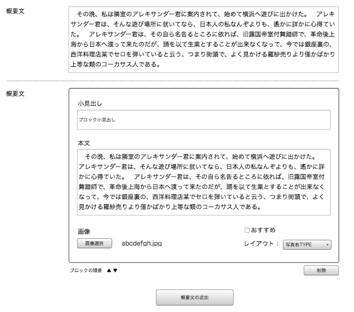
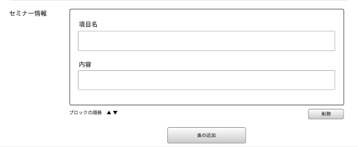

== F-2 イベント新規作成確認画面

=== 概要

イベントの新規登録を行う

=== ワイヤーフレーム

https://docs.google.com/presentation/d/1FioO81AzrWux_G0IQnMI-RIIVhNFcKCN64hdf075AnI/edit#slide=id.g165272825b_2_541

=== 基本情報

[options="header"]
|==================
|項目|内容|備考
|URL|/admin/events/new|
|==================

=== 仕様

image::_include/F-1_promotion_date.png[]

.プロモーション期間設定

* *公開ステータス*

* *記事ID*

* *公開予定日*

* *非公開予定日*

image::_include/F-1_basic_input.png[]

.基本情報入力

* *イベントタイトル*

* *主催者*

* *キーワード*

* *種別*

* *開催エリア*

** *GoogleMap非表示チェックボックス*

** *MAP小見出し*

** *地方選択*

** (地方選択で海外以外)

*** *郵便番号*

*** *都道府県*

*** *住所1*

*** *住所2*

** (地方選択で海外の場合)

*** *Address1*

*** *Address2*

*** *Country*

*** *City*

*** *State/Province*

*** *ZIP/PostalCode*

.概要文

* *概要文テキストエリア*

* *概要文複数入力エリア*

** *小見出し*

** *本文*

** *おすすめチェックボックス*

** *画像選択*

** *レイアウト選択*

image::_include/F-1_experience.png[]

.体験談

** *プロフィール氏名*

** *小見出し*

** *本文*

** *プロフィール画像選択*

** *レイアウト選択*

.セミナー情報

* *項目名*
** input textにて入力

* *内容*
** input textにて入力

image::_include/F-1_inq.png[]

.申込・お問い合わせ情報

* *申込先URL*
** input textにて入力
* *問い合わせ先URL*
** input textにて入力
* *担当者名*
** input textにて入力
* *メールアドレス*
** input textにて入力
* *電話*
** input textにて入力
* *URL*
** input textにて入力

image::_include/F-1_run_button.png[]

.キャンセル／保存ボタン

* *キャンセルボタン*
** 編集画面へ戻る

* *保存ボタン*
** submit送信を行う、C-1 記事一覧画面へ遷移する
