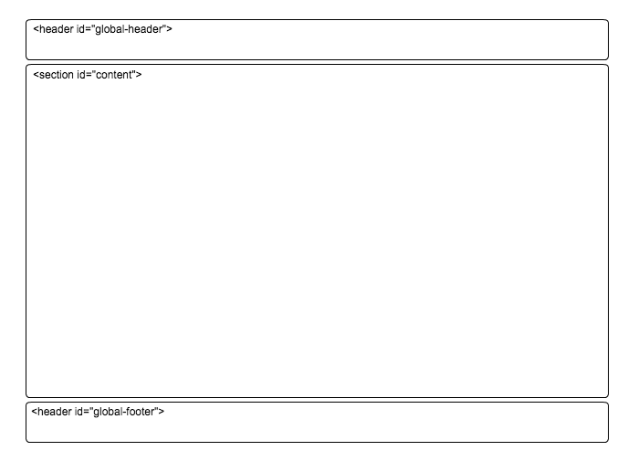

== 基礎レイアウト設計書

=== 構造

以下の3要素から構成される



* ヘッダー
* コンテンツ
** chapter
*** チャプター要素：モジュールやフォーム同士のセクショニングを行う
* フッター

=== コンテンツレイアウト

* http://getbootstrap.com/css/#forms[Bootstrapの例]の中にあるような `.form-group` 等のレイアウトタグを用いて +
適切にを組むこと。
* モジュールごとに `.chapter` で区切る

```
<section id="content">
  <section>
    <div class="chapter">
      <div class="container">
        <h2>World School Management screen</h2>
        <p>please refer to : <a href="http://getbootstrap.com/css/">http://getbootstrap.com/css/</a></p>
      </div>
    </div>

    <div class="chapter">
      <form>
        <div class="form-group">
          <label for="exampleInputEmail1">Email address</label>
          <input type="email" class="form-control" id="exampleInputEmail1" placeholder="Email">
        </div>
        <div class="form-group">
          <label for="exampleInputPassword1">Password</label>
          <input type="password" class="form-control" id="exampleInputPassword1" placeholder="Password">
        </div>
        <div class="form-group">
          <label for="exampleInputFile">File input</label>
          <input type="file" id="exampleInputFile">
          <p class="help-block">Example block-level help text here.</p>
        </div>

        <button type="submit" class="btn btn-default">Submit</button>
      </form>
    </div>
  </section>
</section>
```

=== フォーム

* 必須項目には `required` 属性をつける
* エラー時
** フォームの下にエラー時の文言を配置する
* 日付
** yyyy-MM-dd形式で挿入する
