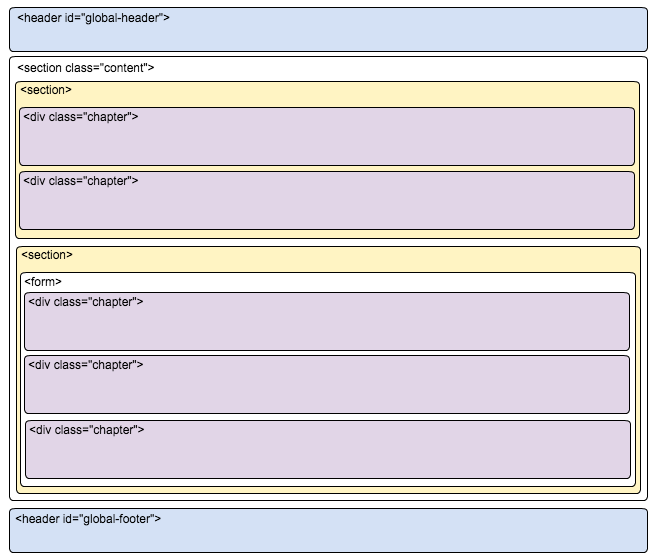

== 基礎レイアウト設計書

=== 構造

以下の3要素から構成される



* ヘッダー
** タグ：header
** id：global-header

ヘッダー内にはメニューのナビゲーションが入る。

* コンテンツ
** タグ：section
** class：content

コンテンツ要素が入る。

* フッター
** タグ：footer
** id：global-footer

コピーライト等の付加情報が入る

=== コンテンツレイアウト

* http://getbootstrap.com/css/#forms[Bootstrapの例]の中にあるような `.form-group` 等を用いて適切にレイアウトを組むこと。
* モジュールごとに `.chapter` で区切る

```

```

=== フォーム

* 必須項目には `required` 属性をつける
