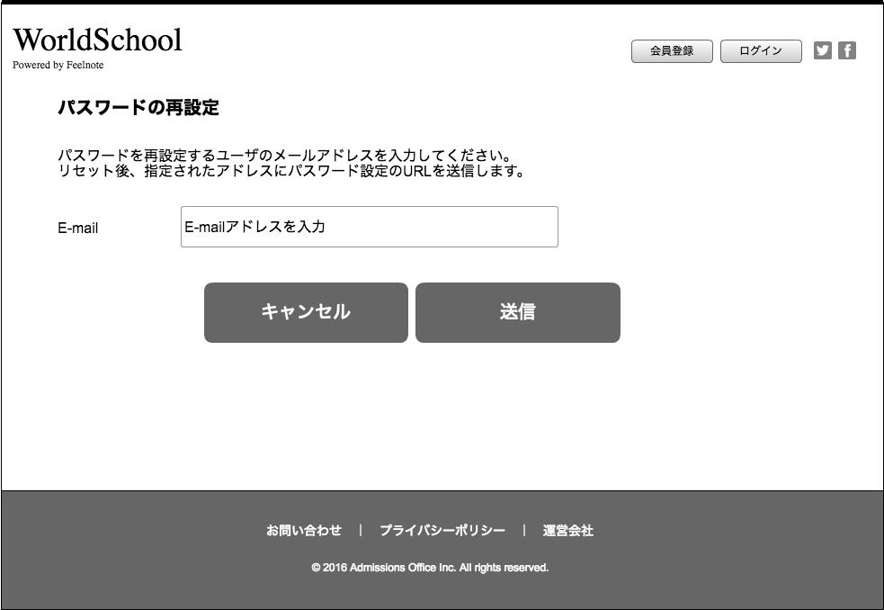

== A-3 Change password screen 

=== Overview

Display change pass screen 

=== Basic info

|=================================
|1       |Input form area    |Display Input Email element 
|2       |OK button area    |Display button
|3       |Cancel button area   |Display button
|=================================

<<<

=== Spec

==== 1.Input form area

include::../../form_site/vi/_include/A-3.adoc[]

==== 2.OK button area  

** Display OK button
** Call link is /password

link:https://github.com/1pac/fg-event/blob/master/doc/detailed_design/src/backend_site/vi/A-3.adoc[]

==== 3.Cancel button area 

** A-1:Go back to login screen 

