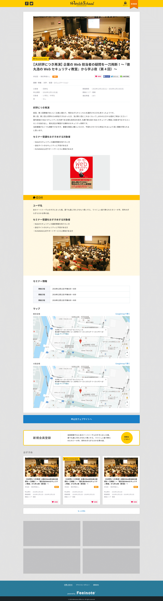

== B-2 Detail screen 

=== Overview

Display event info of the event selected in previous page 

=== Basic info

|=================================
|1       |Event info area    |Display Event info
|2       |Reviews area   |Display Reviews of event
|3       |Seminar info area   |Display event info
|4       |Apply address link button   |Link button to original info of event 
|5       |Sign up button area    |Display Sign up button area 
|6       |Recommend event info area    |Display Recommend event info 
|7       |もっと見る button   |Display more of Recommend event info 
|8       |Promotion banner area    |Display banner 
|=================================

<<<

=== Spec

==== 1. Event info area 

|=================================
|1       |Image    |Key visual of event info 
|2       |Recommend flag    |Display Recommend flag if available
|3       |Event title    |Display Event title  
|4       |Type    |Display event type
|5       |Paid / Free    |Display if need to pay fee or not
|6       |Favorite   |Display Fav button
|6       |SNS area   |Display SNS button
|7       |Organizer    |Display EventOrganizer
|8       |Apply deadline   |Display Event Apply deadline 
|9       |Target   |Display Event Target
|10       |award   |Display Event award
|11       |Opening date  |Display Event Opening date
|12       |Venue   |Display Event Venue
|13       |Advance preparation   |Advance preparation or not
|14       |Event overview    |Display Event overview
|=================================

** Favorite API

link::https://github.com/1pac/fg-event/blob/master/doc/detailed_design/src/backend_api/vi/A0101.adochttps://github.com/1pac/fg-event/blob/master/doc/detailed_design/src/backend_api/vi/A0101.adoc#a0101-lưu-event-yêu-th%C3%ADch-register-favorite-event[]

** SNS
*** facebook
Title of this page and URL and share Images in 1.
*** twitter
Title of this page and URL and write tweets 
*** lineで送る
Title of this page and URL and share in Line

==== 2.Reviews area

** Display review info 

==== 3.Seminar info area

** Display seminar info 
*** For SP, make table display part displayed with vertical scroll（use scroll-container class）
*** Add Google map and link to Googlemap in bottom right 

==== 4.Apply address link button

** Display if Apply address website is available

==== 5.Sign up button area 

** Only display if not login 

==== 6.Recommend event info area 

** Initial display is 3 items
** Display MAX9

==== 7.もっと見る butotn

** When press button, display 3 items each time 
** Display MAX9

==== 8.Promotion banner area 

** Display Promotion banner 
** Display MAX4

