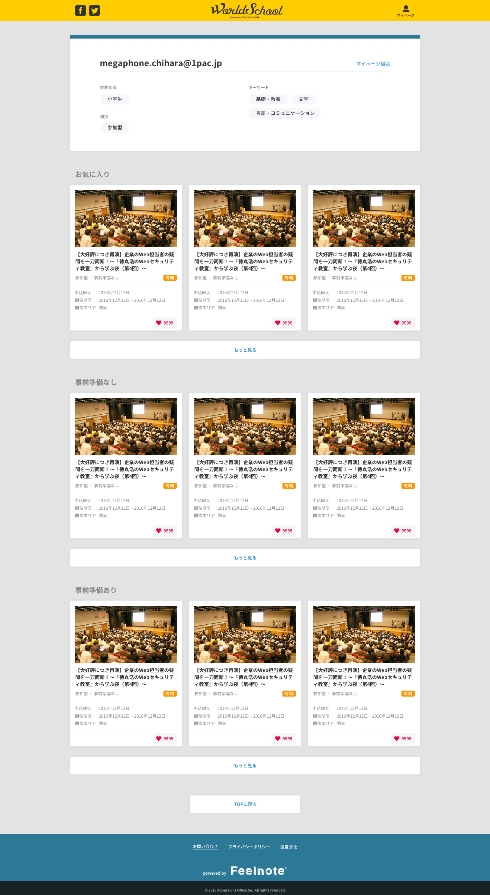

== C-1 My page screen design 

=== Overview

Display user info of login user 

=== Basic info 

|=================================
|1       |user info area    |Display the age set in signup screen
|2       |favorite area   |Publish favorite event
|3       |もっと見る button   |Display more info of favorite event 
|4       |Preparation necessary /unnecessary area   |Publish event with preparation necessary /unnecessary
|5       |もっと見る button   |Display more info of events with preparation necessary /unnecessary  
|=================================

<<<

=== Spec

==== 1.user info area

|=================================
|1       |ID    |Display user ID
|2       |Target age    |Display the age set in signup screen
|3       |Keyword    |Display the keyword set in signup screen
|4       |Type    |Display the type set in signup screen
|5       |My page setting   |Move to C-2 edit setting screen 
|=================================

** Display from api

==== 2.お気に入り(favorite) area 

** Display up to MAX3 event info 

==== 3.もっと見る button

** Move to お気に入り (Favorite) page

==== 4.Preparation necessary /unnecessary area

** Initial display is 3 events
** Display up to MAX9 events 

==== 5.もっと見る button

** Display more of event info under each event of 3 events
** Control by Javascritp
