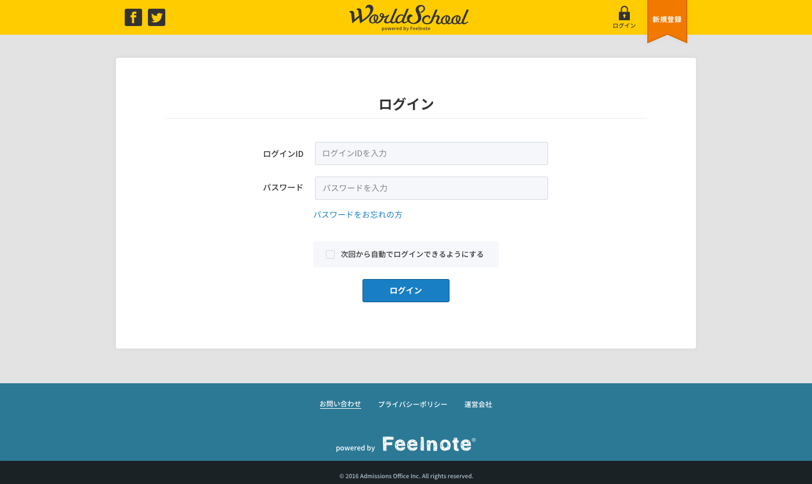

== A-1 ログイン画面詳細設計サンプル

=== 概要

ログイン画面を表示する

=== ワイヤーフレーム

https://docs.google.com/presentation/d/1c4xtvmtKfRsK2KOW7EMndIF1t2zH41a5xZhXg546TOY/edit#slide=id.g165019e56f_0_172

=== 基本情報

|=================================
|1       |入力フォームエリア    |ID、パスワード、自動ログイン可/不可の入力要素を表示
|2       |パスワードをお忘れの方リンク    |パスワードをお忘れの方のリンク
|3       |ログインボタンエリア   |ボタンを表示
|=================================

<<<

=== 仕様

==== 1.入力フォームエリア

include::../../form_site/ja/_include/A-1.adoc[]

==== 2.パスワードをお忘れの方リンク

** [A-3]パスワード変更画面へ遷移 /users/password/new

==== 3.ログインボタンエリア

** ログインボタンを表示
** 呼び出すリンクは /signin

link:https://github.com/1pac/fg-event/blob/master/doc/detailed_design/src/backend_site/ja/A-1.adoc[backend:A-1 ログイン]

