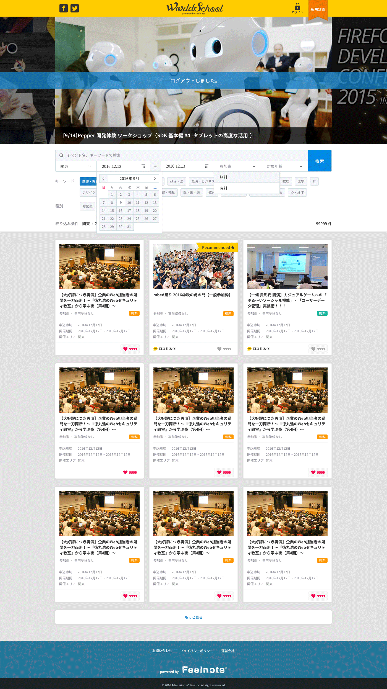
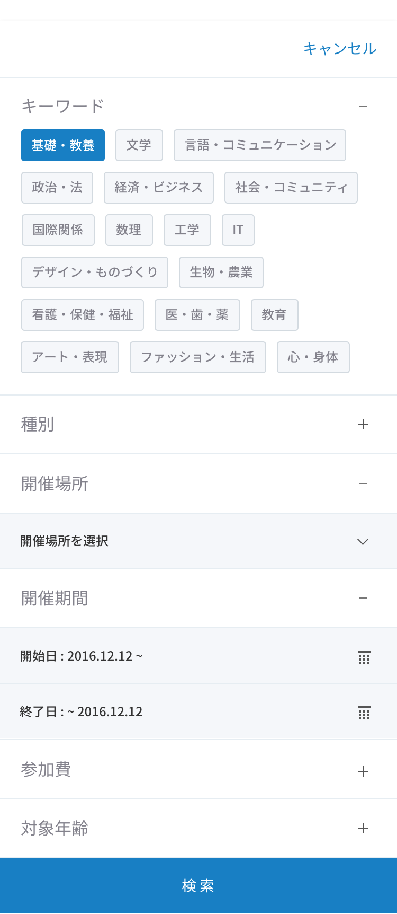

== B-1 トップページ画面詳細設計

=== 概要

WorldSchoolのトップページ

=== 基本情報

|=================================
|1       |プロモーションエリア    |プロモーションバナーを掲載
|2       |検索条件入力エリア   |イベント検索条件を掲載
|3       |イベント情報一覧   |イベントの検索結果を掲載
|4       |もっと見るボタン   |イベント検索結果をさらに表示するボタンを掲載
|=================================

<<<

=== 仕様

==== 1.プロモーションエリア

* カルーセルで表示を切り替えられる
* MAX4件まで表示

link::https://github.com/1pac/fg-event/blob/master/doc/detailed_design/src/frontend_site/ja/07_javascript_basic_design.adoc#カルーセル[]

==== 2.検索条件入力エリア

* PC版
** 検索条件を設定する

include::../../form_site/ja/_include/B-1.adoc[]

** 検索ボタン押下 /api/events

link::https://github.com/1pac/fg-event/blob/71dad3cde94627fac0d676f2329e2d44b4bcc1b0/doc/api_design/build/api_ja.md#ida0201-イベント検索[]

* SP版
** フリーワード、検索ボタン、絞り込み条件を表示させておく
** 検索ボタン押下のAPIはPC版と同じ
** 絞り込み検索ボタン押下で検索の詳細条件画面がスライドインする
** スライドインした詳細条件画面の検索ボタン押下
** ↓詳細条件画面

==== 3.イベント情報一覧

* 初期表示MAX9件
* お気に入り登録
** お気に入りボタンを押下しAPIを呼ぶ

link::https://github.com/1pac/fg-event/blob/master/doc/detailed_design/src/backend_api/ja/A0101.adoc[]

* お気に入り削除
** 再度お気に入りボタンを押下しAPIを呼ぶ

link::https://github.com/1pac/fg-event/blob/master/doc/detailed_design/src/backend_api/ja/A0102.adoc[]

==== 4.もっと見るボタン

* 画面表示時に呼び出すAPIがセットされる

