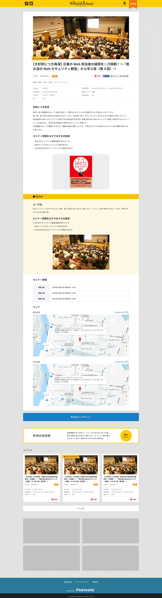

== B-2 詳細画面詳細設計サンプル

=== 概要

前ページで選択されたイベントの詳細情報を表示する

=== 基本情報

|=================================
|1       |イベント情報詳細エリア    |イベントの詳細情報を掲載
|2       |口コミエリア   |イベントの口コミを掲載
|3       |セミナー情報エリア   |イベントの詳細情報を掲載
|4       |申込先ウェブサイトリンクボタン   |イベントの元情報へのリンクボタン
|5       |新規会員登録ボタンエリア   |新規会員登録ボタンエリアを表示する
|6       |おすすめイベント情報エリア   |おすすめのイベント情報を掲載
|7       |もっと見るボタン   |おすすめイベント情報をさらに表示
|8       |プロモーションバナーエリア   |バナー表示エリア
|=================================

<<<

=== 仕様

==== 1.イベント情報詳細エリア

|=================================
|1       |写真    |イベント情報のキービジュアル
|2       |レコメンドフラグ    |レコメンドフラグがあれば表示
|3       |イベントタイトル    |イベント情報のタイトルを表示
|4       |種別    |イベントの種別を表示
|5       |有料/無料    |イベントの有料/無料を表示
|6       |お気に入り    |お気に入りボタンを表示
|6       |SNSエリア    |SNSボタンを表示
|7       |主催者    |イベントの主催者を表示
|8       |申込期限   |イベントの申込期限を表示
|9       |対象者   |イベントの対象者を表示
|10       |賞   |イベントの賞を表示
|11       |開催期間  |イベントの開催期限を表示
|12       |開催エリア   |イベントの開催エリアを表示
|13       |事前準備   |事前準備あり/なしを表示
|14       |イベント概要エリア   |イベント情報の概要を表示
|=================================

** お気に入りAPI

link::https://github.com/1pac/fg-event/blob/master/doc/detailed_design/src/backend_api/ja/A0101.adoc#a0101-イベントお気に入り登録[]

** SNS
*** facebook
このページのタイトルとURLと1.写真をシェアする
*** twitter
このページのタイトルタグとURLをツイート情報とする
*** lineで送る
このページのタイトルタグとURLをlineでシェアする

==== 2.口コミエリア

** 口コミ情報を表示する

==== 3.セミナー情報エリア

** セミナー情報を表示する
*** table表示の部分はSP版の時横スクロールが表示されるようにする
*** GoogleマップとGooglemapへのリンクを右上に付加する

==== 4.申込先ウェブサイトリンクボタン

** 申込先のウェブサイトがある場合のみ表示

==== 5.新規会員登録ボタンエリア

** 未ログインの場合のみ表示

==== 6.おすすめイベント情報エリア

** 初期表示は3件まで
** MAX9件表示

==== 7.もっと見るボタン

** ボタン押下すると3件ずつ表示される
** MAX9件表示

==== 8.プロモーションバナーエリア

** プロモーションバナーを表示
** MAX4件
