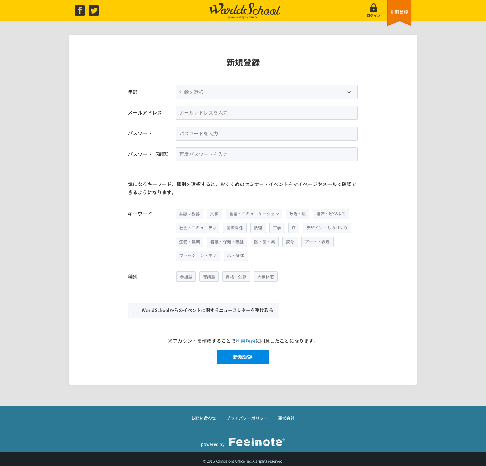

== D-1 新規登録画面詳細設計サンプル

=== 概要

新規会員登録画面を表示する

=== ワイヤーフレーム

https://docs.google.com/presentation/d/1c4xtvmtKfRsK2KOW7EMndIF1t2zH41a5xZhXg546TOY/edit#slide=id.g165019e56f_0_172

=== 基本情報

|=================================
|1       |入力フォームエリア    |会員情報入力フォームを掲載
|2       |利用規約リンク   |利用規約ページヘ遷移
|3       |新規登録ボタン   |ボタンを掲載
|=================================

<<<

=== 仕様

==== 1.入力フォームエリア

** 入力フォーム

include::../../form_site/ja/_include/D-1.adoc[]

==== 2.利用規約リンク

** 利用規約リンク /term.html

==== 3.新規登録ボタン

** 新規登録先 /users

link::https://github.com/1pac/fg-event/blob/master/doc/detailed_design/src/backend_site/ja/D-1.adoc#d-1-a-会員登録-処理[D-1-a-会員登録-処理]

